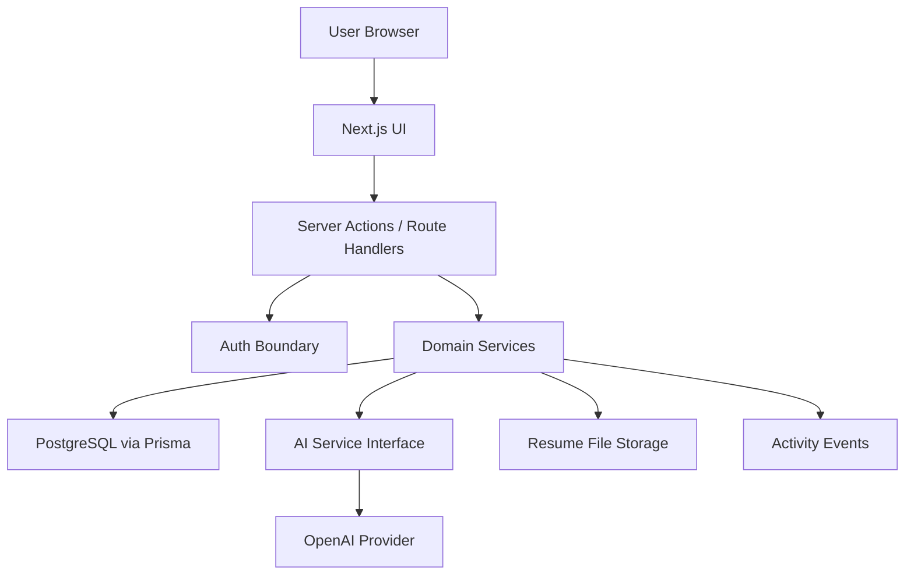

# System Architecture

## Recommended Stack

| Area | Choice | Why |
| --- | --- | --- |
| Frontend | Next.js App Router, React, TypeScript | Fast full-stack delivery with strong typing and deployability. |
| Backend | Next.js route handlers and server actions | Keeps Phase 1 a modular monolith. |
| Database | PostgreSQL | Reliable relational model for user-owned product data. |
| ORM | Prisma | Productive migrations, typed queries, broad ecosystem support. |
| Auth | Auth.js with Prisma adapter | Mature Next.js auth with replaceable providers. |
| Validation | Zod | Shared request, form, and AI-output validation. |
| AI | OpenAI via `AiProvider` interface | Strong structured-output support, replaceable boundary. |
| File storage | Vercel Blob, S3-compatible storage, or Supabase Storage | Affordable object storage for resume files. |
| Resume parsing | Paste-first, later `pdf-parse`/Mammoth server-side | Keeps MVP simple while allowing file parsing. |
| Styling | Tailwind CSS | Fast responsive UI with low overhead. |
| Components | shadcn/ui | Professional, accessible primitives without vendor lock-in. |
| Testing | Vitest, RTL, Playwright | Covers domain logic, UI, and critical journeys. |
| Logging | Pino or platform logs with redaction | Structured logs without leaking sensitive content. |
| Analytics | Internal `ActivityEvent` table first | Avoids external analytics complexity. |
| Deployment | Vercel + managed Postgres | Low operational burden for early SaaS. |
| CI/CD | GitHub Actions | Standard lint, typecheck, test, migration checks. |
| Error monitoring | Sentry later in Phase 1G | Useful before testers and production launch. |

## High-Level Architecture

The app is a modular monolith. UI routes call server actions or route handlers. Domain services enforce authorization and business rules. Repositories use Prisma. AI calls go through a provider interface and validate all structured responses before persistence.

## Module Boundaries

- `auth`: sessions, user identity, ownership checks.
- `profiles`: career profile, preferences, skills.
- `resumes`: resume text, file metadata, default version.
- `jobs`: job CRUD, normalization, hard criteria.
- `matching`: AI scoring, ranking, recommendations.
- `duplicates`: explainable duplicate analysis.
- `questions`: approved answers, matching, reuse policy.
- `reviewQueue`: user decisions and low-confidence items.
- `applications`: application status and materials.
- `exports`: CSV exports.
- `activity`: lightweight analytics events.

## Data Flow

1. User signs in.
2. User creates profile and preferences.
3. User pastes or uploads resume.
4. User manually adds a job.
5. Duplicate service checks existing jobs and applications.
6. Hard criteria are evaluated.
7. AI scoring runs only when useful.
8. Validated score is saved.
9. Dashboard ranks eligible jobs.
10. User generates an application package.
11. Low-confidence questions enter review queue.
12. Approved answers are saved and reused.

## AI Request Flow

1. Domain service loads only the requesting user's data.
2. Inputs are normalized, minimized, and marked by trust level.
3. Prompt template version is selected.
4. AI provider is called with timeout and token cap.
5. JSON response is parsed and validated by Zod.
6. Invalid output gets one repair/retry attempt.
7. Final failures create a review item or user-visible error.
8. Prompt version, model, confidence, and redacted metadata are stored.

## Security Boundaries

- Every data access is scoped by `userId`.
- Route handlers and server actions require session validation.
- Job descriptions and resumes are untrusted prompt content.
- AI outputs are untrusted until schema validated.
- Sensitive content is excluded from logs.
- File uploads enforce type, size, and storage rules.

## Deployment Structure

- Web app: Vercel.
- Database: managed Postgres.
- File storage: object storage.
- Secrets: deployment environment variables.
- CI: GitHub Actions.
- Migrations: Prisma migrate during deploy workflow or controlled release step.

## Evolution

Phase 2 can add ingestion modules, email imports, background workers, and vector search without changing core ownership boundaries. Phase 3 can add browser automation as a separate integration layer that consumes existing jobs, applications, questions, and approved answers.

## Architecture Decision Records

Initial ADRs should capture:

- modular monolith over microservices
- Next.js full-stack app
- Postgres and Prisma
- AI provider abstraction
- paste-first resume flow
- internal analytics event table
